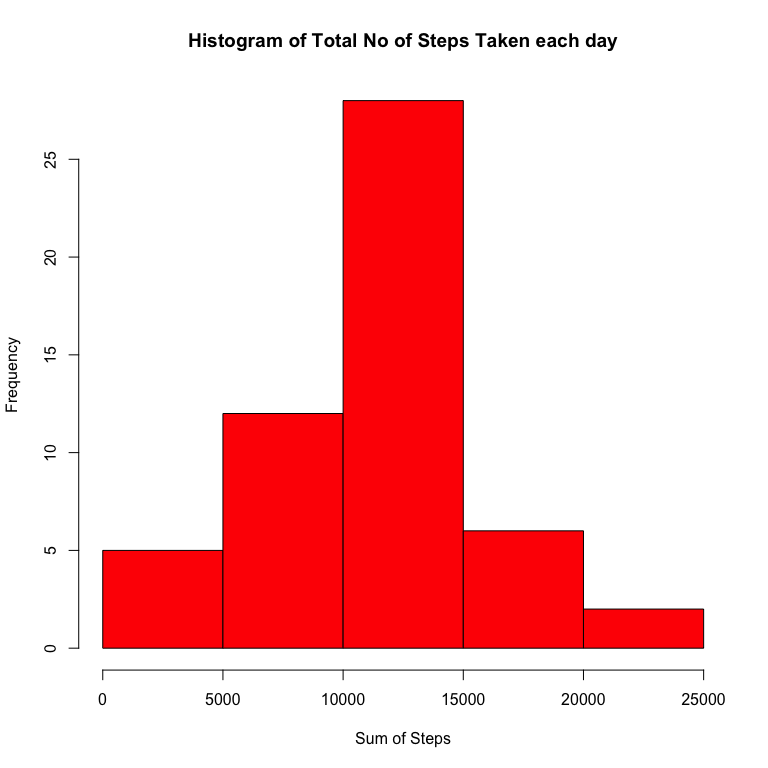
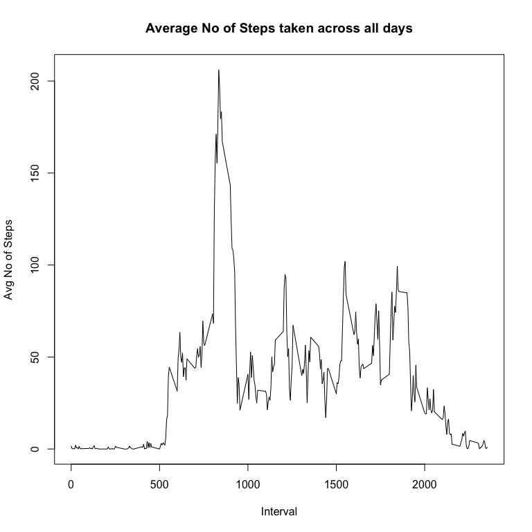
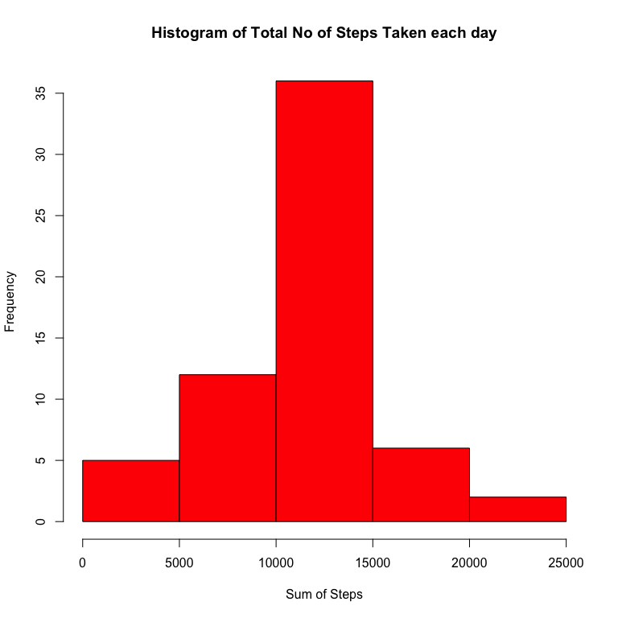
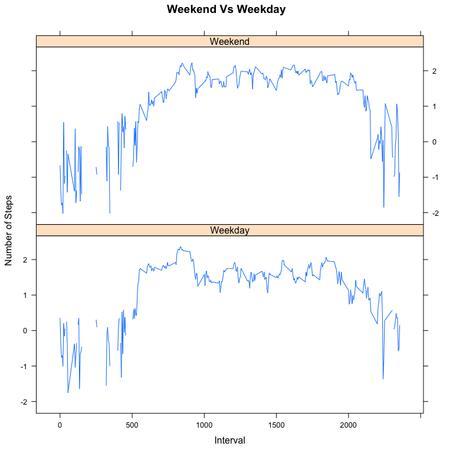

# Reproducible Research: Peer Assessment 1
Sai  
September 18, 2015  

##Loading and preprocessing the data

1. Load the data (i.e. read.csv())
2. Process/transform the data (if necessary) into a format suitable for your analysis


```r
data<- read.csv("./data/activity.csv")
data$date <- as.Date(data$date, '%Y-%m-%d')
# Omitting the rows with NA Values
data1 <- na.omit(data)
```

##What is mean total number of steps taken per day?

1. Calculate the total number of steps taken per day

```r
#Calculating sum of steps taken per day
sumofsteps <- aggregate(data1$steps,by =list(date = data1$date),sum)
names(sumofsteps)[2] <- "sum"
library(knitr)
kable(sumofsteps, align = 'c')
```

    date        sum  
------------  -------
 2012-10-02     126  
 2012-10-03    11352 
 2012-10-04    12116 
 2012-10-05    13294 
 2012-10-06    15420 
 2012-10-07    11015 
 2012-10-09    12811 
 2012-10-10    9900  
 2012-10-11    10304 
 2012-10-12    17382 
 2012-10-13    12426 
 2012-10-14    15098 
 2012-10-15    10139 
 2012-10-16    15084 
 2012-10-17    13452 
 2012-10-18    10056 
 2012-10-19    11829 
 2012-10-20    10395 
 2012-10-21    8821  
 2012-10-22    13460 
 2012-10-23    8918  
 2012-10-24    8355  
 2012-10-25    2492  
 2012-10-26    6778  
 2012-10-27    10119 
 2012-10-28    11458 
 2012-10-29    5018  
 2012-10-30    9819  
 2012-10-31    15414 
 2012-11-02    10600 
 2012-11-03    10571 
 2012-11-05    10439 
 2012-11-06    8334  
 2012-11-07    12883 
 2012-11-08    3219  
 2012-11-11    12608 
 2012-11-12    10765 
 2012-11-13    7336  
 2012-11-15     41   
 2012-11-16    5441  
 2012-11-17    14339 
 2012-11-18    15110 
 2012-11-19    8841  
 2012-11-20    4472  
 2012-11-21    12787 
 2012-11-22    20427 
 2012-11-23    21194 
 2012-11-24    14478 
 2012-11-25    11834 
 2012-11-26    11162 
 2012-11-27    13646 
 2012-11-28    10183 
 2012-11-29    7047  

2. Make a histogram of the total number of steps taken each day

```r
hist(sumofsteps$sum,
     main = "Histogram of Total No of Steps Taken each day",
     xlab = "Sum of Steps",
     col = "red")
```



3. Calculate and report the mean and median of the total number of steps taken per day

```r
meanofsteps <- aggregate(data1$steps,by=list(date = data1$date),mean)
names(meanofsteps)[2] <- "mean/median"
kable(meanofsteps,align = 'c')
```

    date       mean/median 
------------  -------------
 2012-10-02     0.4375000  
 2012-10-03    39.4166667  
 2012-10-04    42.0694444  
 2012-10-05    46.1597222  
 2012-10-06    53.5416667  
 2012-10-07    38.2465278  
 2012-10-09    44.4826389  
 2012-10-10    34.3750000  
 2012-10-11    35.7777778  
 2012-10-12    60.3541667  
 2012-10-13    43.1458333  
 2012-10-14    52.4236111  
 2012-10-15    35.2048611  
 2012-10-16    52.3750000  
 2012-10-17    46.7083333  
 2012-10-18    34.9166667  
 2012-10-19    41.0729167  
 2012-10-20    36.0937500  
 2012-10-21    30.6284722  
 2012-10-22    46.7361111  
 2012-10-23    30.9652778  
 2012-10-24    29.0104167  
 2012-10-25     8.6527778  
 2012-10-26    23.5347222  
 2012-10-27    35.1354167  
 2012-10-28    39.7847222  
 2012-10-29    17.4236111  
 2012-10-30    34.0937500  
 2012-10-31    53.5208333  
 2012-11-02    36.8055556  
 2012-11-03    36.7048611  
 2012-11-05    36.2465278  
 2012-11-06    28.9375000  
 2012-11-07    44.7326389  
 2012-11-08    11.1770833  
 2012-11-11    43.7777778  
 2012-11-12    37.3784722  
 2012-11-13    25.4722222  
 2012-11-15     0.1423611  
 2012-11-16    18.8923611  
 2012-11-17    49.7881944  
 2012-11-18    52.4652778  
 2012-11-19    30.6979167  
 2012-11-20    15.5277778  
 2012-11-21    44.3993056  
 2012-11-22    70.9270833  
 2012-11-23    73.5902778  
 2012-11-24    50.2708333  
 2012-11-25    41.0902778  
 2012-11-26    38.7569444  
 2012-11-27    47.3819444  
 2012-11-28    35.3576389  
 2012-11-29    24.4687500  

##What is the average daily activity pattern?
1. Make a time series plot (i.e. type = "l") of the 5-minute interval (x-axis) and the average number of steps taken, averaged across all days (y-axis)


```r
avgint <- aggregate(data1$steps,by=list(interval = data1$interval),mean)
plot(avgint$interval, avgint$x,type = 'l',
     main = "Average No of Steps taken across all days",
     xlab = "Interval",
     ylab = "Avg No of Steps")
```


2. Which 5-minute interval, on average across all the days in the dataset, contains the maximum number of steps?

**The 5-minute interval 835 has the maximum number of steps i.e 206.1698113**

#Imputing missing values
1. Calculate and report the total number of missing values in the dataset (i.e. the total number of rows with NAs)

```r
missval <- nrow(data) - nrow(data1)
```

**The number of missing values in the data is 2304.**

2. Filling in all of the missing values in the dataset with the mean for that 5-minute interval
3. Create a new dataset that is equal to the original dataset but with the missing data filled in.


```r
origdata <- data
for (i in 1:nrow(data))
{
  if(is.na(data[i,1]))
  {
    intrval <- data[i,3]
    data[i,1] <- avgint[avgint$interval==intrval,2]
  }
}
```

4. Make a histogram of the total number of steps taken each day and Calculate and report the mean and median total number of steps taken per day.


```r
sumofsteps <- aggregate(data$steps,by =list(date = data$date),sum)
names(sumofsteps)[2] <- "sum"
hist(sumofsteps$sum,
     main = "Histogram of Total No of Steps Taken each day",
     xlab = "Sum of Steps",
     col = "red")
```




```r
#Calculating the Mean/Median
meanofsteps1 <- aggregate(data$steps,by=list(date = data$date),mean)
names(meanofsteps1)[2] <- "mean/median"
kable(meanofsteps1,align = 'c')
```

    date       mean/median 
------------  -------------
 2012-10-01    37.3825996  
 2012-10-02     0.4375000  
 2012-10-03    39.4166667  
 2012-10-04    42.0694444  
 2012-10-05    46.1597222  
 2012-10-06    53.5416667  
 2012-10-07    38.2465278  
 2012-10-08    37.3825996  
 2012-10-09    44.4826389  
 2012-10-10    34.3750000  
 2012-10-11    35.7777778  
 2012-10-12    60.3541667  
 2012-10-13    43.1458333  
 2012-10-14    52.4236111  
 2012-10-15    35.2048611  
 2012-10-16    52.3750000  
 2012-10-17    46.7083333  
 2012-10-18    34.9166667  
 2012-10-19    41.0729167  
 2012-10-20    36.0937500  
 2012-10-21    30.6284722  
 2012-10-22    46.7361111  
 2012-10-23    30.9652778  
 2012-10-24    29.0104167  
 2012-10-25     8.6527778  
 2012-10-26    23.5347222  
 2012-10-27    35.1354167  
 2012-10-28    39.7847222  
 2012-10-29    17.4236111  
 2012-10-30    34.0937500  
 2012-10-31    53.5208333  
 2012-11-01    37.3825996  
 2012-11-02    36.8055556  
 2012-11-03    36.7048611  
 2012-11-04    37.3825996  
 2012-11-05    36.2465278  
 2012-11-06    28.9375000  
 2012-11-07    44.7326389  
 2012-11-08    11.1770833  
 2012-11-09    37.3825996  
 2012-11-10    37.3825996  
 2012-11-11    43.7777778  
 2012-11-12    37.3784722  
 2012-11-13    25.4722222  
 2012-11-14    37.3825996  
 2012-11-15     0.1423611  
 2012-11-16    18.8923611  
 2012-11-17    49.7881944  
 2012-11-18    52.4652778  
 2012-11-19    30.6979167  
 2012-11-20    15.5277778  
 2012-11-21    44.3993056  
 2012-11-22    70.9270833  
 2012-11-23    73.5902778  
 2012-11-24    50.2708333  
 2012-11-25    41.0902778  
 2012-11-26    38.7569444  
 2012-11-27    47.3819444  
 2012-11-28    35.3576389  
 2012-11-29    24.4687500  
 2012-11-30    37.3825996  

#Are there differences in activity patterns between weekdays and weekends?

1. Create a new factor variable in the dataset with two levels – “weekday” and “weekend” indicating whether a given date is a weekday or weekend day.


```r
day <- character(length = nrow(data))

for (i in 1:nrow(data))
{
  if (weekdays(data$date[i]) == "Sunday" | weekdays(data$date[i]) == "Saturday")
  {
    day[i] <- "Weekend"
  }
  else
  {
    day[i] <- "Weekday"
  }
}
day <- as.factor(day)
# Combining the factor with the original data
data <- cbind(data,day)
```

2. Make a panel plot containing a time series plot (i.e. type = "l") of the 5-minute interval (x-axis) and the average number of steps taken, averaged across all weekday days or weekend days (y-axis).

```r
avgint <- aggregate(data$steps,by=list(interval = data$interval, days = data$day),mean)

library(lattice)
xyplot(log10(avgint$x) ~ avgint$interval|avgint$days,
       layout = c(1,2), type = 'l', xlab = "Interval",
       ylab = "Number of Steps",
       main = "Weekend Vs Weekday")
```




